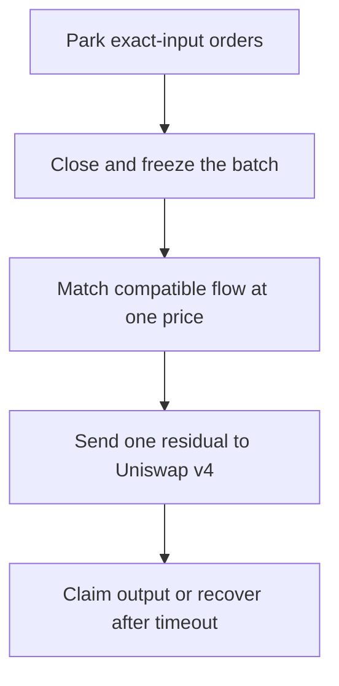

<p align="center">
  
</p>

<a id="aura"></a>
<h1 align="center">AURA</h1>

<h3 align="center">Bounded batch settlement for Uniswap v4</h3>

<p align="center">
  <strong>
    Park compatible intent. Match it directly. Send only the residual to the pool.
  </strong>
</p>

<p align="center">
  <a href="#why-aura">Why Aura</a> ·
  <a href="#how-aura-works">How it works</a> ·
  <a href="#features">Features</a> ·
  <a href="#judge-demo">Demo</a> ·
  <a href="#run-locally">Run locally</a> ·
  <a href="#verification">Tests</a> ·
  <a href="#security-model">Security</a>
</p>

[](https://soliditylang.org/)
[](https://book.getfoundry.sh/)
[](https://docs.uniswap.org/contracts/v4/overview)
[](./LICENSE)

[](#judge-demo)
[](#scope)
[](#scope)
[](#how-aura-works)

---

> [!IMPORTANT]
> **Aura is a tested Hookathon build with a deterministic local judge demo.**
> It is not publicly deployed or production-ready. The interface uses local
> fixture data and does not represent live user orders or public-chain
> transactions.

## At a glance

| | |
| --- | --- |
| **Project** | Aura |
| **Category** | Uniswap v4 hook |
| **Core idea** | Match compatible orders before touching the pool |
| **Settlement model** | Bounded batch auction with one uniform price |
| **Judge path** | Deterministic Settlement Console plus contract tests |
| **Public deployment** | Not included |
| **Prize-track partner integrations** | None |
| **License** | MIT |

<!--
Add the final hero screenshot after capturing it at the submission commit:


-->

## Table of contents

<details>
<summary><strong>Open navigation</strong></summary>

- [Why Aura](#why-aura)
- [The problem](#the-problem)
- [The solution](#the-solution)
- [How Aura works](#how-aura-works)
- [What makes Aura different](#what-makes-aura-different)
- [Features](#features)
- [Scope](#scope)
- [Architecture](#architecture)
- [Judge demo](#judge-demo)
- [Run locally](#run-locally)
- [Using the Settlement Console](#using-the-settlement-console)
- [Verification](#verification)
- [Security model](#security-model)
- [Partner integrations](#partner-integrations)
- [New work for this Hookathon](#new-work-for-this-hookathon)
- [Challenges and lessons](#challenges-and-lessons)
- [Evidence and provenance](#evidence-and-provenance)
- [Credits](#credits)
- [License](#license)

</details>

---

<a id="why-aura"></a>
## Why Aura

Aura started with one practical question:

> **If two users want opposite sides of a trade, why should all of their volume
> hit the AMM curve first?**

Ordinary pool execution treats each order independently. Yet compatible buy
and sell intent may already exist inside a small group of users. Aura explores
a different sequence: collect a tightly bounded batch, match what naturally
fits, and use Uniswap v4 only for the difference.

That makes the pool the **residual venue**, not the first venue.

## The problem

Sending every order directly through an automated market maker can create
avoidable price impact and consume liquidity even when another user wants to
trade in the opposite direction.

Batch settlement can reduce that unnecessary movement, but only if it is
designed with strong boundaries. Otherwise, a publisher might manipulate the
price, change batch membership, submit a malformed residual, or leave users
dependent on an unavailable off-chain service.

Aura narrows those risks into a system that judges can inspect:

| Risk | Aura boundary |
| --- | --- |
| Publisher chooses a favorable price | The hook derives one canonical price from the frozen feasible interval |
| Orders change during settlement | Batch membership freezes before settlement |
| Residual execution becomes arbitrary | Only one exact-input residual swap is permitted |
| Claims lose their backing | Liabilities and dust are checked against hook-owned ERC-6909 claims |
| A proposal is reused | Settlement solutions are replay-protected |
| An external service disappears | Owners retain a fixed permissionless timeout-refund path |

## The solution

Aura is a narrowly scoped Uniswap v4 hook that:

1. parks exact-input orders without immediately moving the pool curve;
2. freezes a batch containing no more than four orders;
3. computes one canonical uniform clearing price;
4. matches compatible volume directly;
5. sends at most one unmatched residual through the pool; and
6. credits recipient-controlled claims or returns unsettled input after timeout.

> [!NOTE]
> Aura deliberately chooses depth over breadth. One pool, one bounded batch,
> one canonical price, one residual, and one clear recovery path make the
> protocol easier to verify.

<a id="how-aura-works"></a>
## How Aura works



### 01. Park

Users enter through `AuraRouter.placeOrder`. The router binds order ownership
to the actual caller and forwards the single approved pool key.

`AuraHook` records the order and holds the input through the PoolManager's
ERC-6909 claim system. Parking does not immediately execute the order against
the pool curve.

### 02. Close

The hook closes the batch only after its protocol conditions are satisfied. It
freezes membership and checks capacity, deadlines, price feasibility, and
payout encoding.

Once closed, the batch cannot silently change underneath settlement.

### 03. Match

`AuraSettlementVerifier` reconstructs the frozen order state. Aura derives one
canonical rational clearing price and calculates the volume that can match
directly.

The proposal does not get to rewrite the rules. The hook independently checks
membership, price, payouts, matched volume, residual direction, backing, and
final accounting.

### 04. Settle the residual

If the two order directions do not perfectly balance, Aura sends only the
remaining difference through Uniswap v4 as a single exact-input swap.

Every PoolManager delta must resolve before the unlock returns.

### 05. Claim or refund

Successful settlement records recipient-owned claimable balances. Recipients
pull their underlying output through the claim path.

If settlement does not complete, owners can recover parked input after the
fixed timeout boundary.

## What makes Aura different

| Principle | What it means |
| --- | --- |
| **Match first** | Compatible flow settles directly before the pool is used |
| **One price** | Every order in the frozen batch uses the same canonical price |
| **Residual only** | No more than one unmatched exact-input swap reaches the pool |
| **Hook verified** | The contract recomputes the solution instead of trusting the publisher |
| **Sovereign claims** | Recipients control when to pull their settled output |
| **Independent recovery** | Refunds do not depend on an off-chain operator remaining available |
| **Evidence aware** | Local fixtures, traces, and public transactions are labeled differently |

<a id="features"></a>
## Features

<table>
<tr>
<td width="50%" valign="top">

### Settlement

- Canonical uniform clearing price
- Direct peer-to-peer matching
- Maximum one residual pool swap
- Frozen batch membership
- Solution replay protection
- Strict settlement validation

</td>
<td width="50%" valign="top">

### User protection

- Router-authenticated ownership
- Recipient-controlled claims
- Failed-transfer rollback
- Permissionless timeout refunds
- ERC-6909-backed liabilities
- Explicit protocol-dust accounting

</td>
</tr>
<tr>
<td width="50%" valign="top">

### Verification

- Unit tests
- Fuzz tests
- Integration tests
- Regression tests
- Invariant coverage
- Contract-size checks

</td>
<td width="50%" valign="top">

### Judge experience

- Responsive Settlement Console
- Direct-match and residual visualization
- Perfect CoW scenario
- Claim-state evidence
- Failure and recovery previews
- Explicit evidence provenance

</td>
</tr>
</table>

## Scope

### Included

- One immutable Uniswap v4 pool.
- Exact-input, full-fill orders.
- Two order directions.
- Maximum of four orders in the active batch.
- Strict 20-block intake window.
- Canonical rational clearing price.
- Peer-to-peer matching before pool execution.
- At most one residual swap.
- Claim liabilities, protocol dust, and timeout refunds.
- Contract tests and deterministic judge interface.

### Not included

- Exact-output orders.
- Partial fills.
- Multi-hop routing.
- Multi-pool batches.
- Arbitrary solver call plans.
- Live wallets.
- Automated off-chain settlement transport.
- Public deployment or production liquidity.

> [!WARNING]
> The judged build is not production-ready. Do not present local fixture
> addresses as deployed contracts or local trace identifiers as public
> transaction hashes.

## Architecture

| Component | Responsibility | Trust boundary |
| --- | --- | --- |
| [`AuraRouter`](./src/AuraRouter.sol) | Authenticates order entry and submits the immutable pool | Cannot assign a different owner or pool |
| [`AuraHook`](./src/AuraHook.sol) | Parks input, freezes batches, settles residual flow, and accounts for claims and refunds | Final on-chain accounting authority |
| [`AuraClearingMath`](./src/libraries/AuraClearingMath.sol) | Calculates price, payouts, matching, residuals, and conservation bounds | Pure deterministic math |
| [`AuraSettlementVerifier`](./src/AuraSettlementVerifier.sol) | Reconstructs and validates the frozen solution | Reads trusted state from the calling hook |
| Settlement Console | Explains the lifecycle and displays evidence | Untrusted presentation layer |

### Technical documentation

| Document | Purpose |
| --- | --- |
| [`docs/design.md`](./docs/design.md) | Protocol behavior and accounting specification |
| [`docs/security.md`](./docs/security.md) | Threat model and verified invariants |
| [`docs/AURA_CODEX_BUILD_REPORT.md`](./docs/AURA_CODEX_BUILD_REPORT.md) | Consolidated architecture and build evidence |
| [`docs/demo-runbook.md`](./docs/demo-runbook.md) | Three-minute judge presentation and recovery plan |
| [`NOTICE.md`](./NOTICE.md) | Project origin and upstream attribution |

<a id="judge-demo"></a>
## Judge demo

<!--
REQUIRED BEFORE SUBMISSION:

Replace this comment with the final public video link:
[Watch the Aura demo](PUBLIC_VIDEO_URL)

The video must be publicly accessible, no longer than five minutes, and use a
human voice. The Aura runbook targets approximately three minutes.
-->

### The presentation story

> **Park together → match directly → settle the residual → claim sovereignly**

The recommended judge path uses the same Settlement Console for the complete
demonstration. It requires no wallet, faucet, public RPC, deployment, signature,
broadcast, pool initialization, or funds.

### What the judge should see

| Stage | Visible proof |
| --- | --- |
| Park | Opposite orders enter the bounded batch without displayed curve movement |
| Close | Membership freezes at the intake boundary |
| Match | One price applies to both directions |
| Residual | Direct-match volume is separated from the single pool residual |
| Claim | Output appears as a recipient-controlled liability and is claimed |
| Perfect CoW | Direct matching reaches 100% with zero residual and no pool movement |

<a id="run-locally"></a>
## Run locally

### Prerequisites

| Requirement | Version |
| --- | --- |
| Git | Current stable release |
| Foundry | `1.7.1` |
| Node.js | `>=22.22.2` |
| npm | Included with supported Node.js |

### 1. Clone the repository

```bash
git clone https://github.com/rainwaters11/Aura.git
cd Aura
git submodule update --init --recursive
```

Use the exact final branch or commit included with the Hookathon submission.

### 2. Install frontend dependencies

```bash
cd frontend
npm ci
```

### 3. Start the console

```bash
npm run dev
```

Open [`http://localhost:5173`](http://localhost:5173).

> [!TIP]
> No username, password, wallet, private key, API key, or RPC credential is
> required for the deterministic local demo.

## Using the Settlement Console

1. Click <kbd>Load demo orders</kbd>.
2. Confirm that two opposite orders appear as parked.
3. Confirm that the displayed pool price and tick remain unchanged.
4. Click <kbd>Close batch</kbd>.
5. Click <kbd>Submit solution</kbd>.
6. Compare direct-match volume with residual volume.
7. Confirm that unresolved PoolManager deltas equal zero.
8. Click the dynamic claim control, shown by the default fixture as
   <kbd>Claim 4 WETH</kbd>.
9. Reset the console and select <kbd>Perfect CoW</kbd>.
10. Repeat the flow and confirm 100% direct matching, zero residual volume, and
    no pool price or tick movement.

> [!NOTE]
> **Load demo orders** creates deterministic local fixture data. It does not
> place live user orders or broadcast transactions. The Solidity test suite
> verifies hook behavior separately.

### Recovery previews

| State | URL |
| --- | --- |
| Disconnected | `http://localhost:5173/?preview=disconnected` |
| Wrong network | `http://localhost:5173/?preview=wrong-network` |
| Data unavailable | `http://localhost:5173/?preview=unavailable` |
| Claim error | `http://localhost:5173/?preview=claim-error` |

<a id="verification"></a>
## Verification

Run all checks from the exact commit used for the video and final submission.

<details open>
<summary><strong>Smart-contract verification</strong></summary>

```bash
forge fmt --check
forge build --sizes
forge test --match-contract DeployAuraTest -vv
forge test -vv
```

The latest reviewed local tree reported:

| Check | Reported result |
| --- | ---: |
| Solidity tests | `211 passed, 0 failed` |
| Documented RPC-dependent skips | `8` |
| Optimized `AuraHook` runtime | `21,716 bytes` |
| EIP-170 margin | `2,860 bytes` |

</details>

<details>
<summary><strong>Frontend verification</strong></summary>

```bash
cd frontend
npm ci
npm run format:check
npm run lint
npm run typecheck
npm test
npm run build
```

</details>

> [!CAUTION]
> The reported numbers are local evidence. Rerun every command at the final
> submission commit and update the table if the observed results change. Do not
> reuse an earlier run as exact-head evidence.

<a id="security-model"></a>
## Security model

| Property | Enforcement |
| --- | --- |
| Authenticated order ownership | Router binds the owner to the actual caller |
| Bounded state | Active batch capacity is limited to four orders |
| Frozen settlement domain | Membership cannot change after closure |
| Canonical price | Derived from the frozen feasible interval |
| Restricted execution | No arbitrary external call plan is accepted |
| Residual limit | Maximum of one exact-input pool swap |
| Delta discipline | PoolManager deltas must resolve before return |
| Backed liabilities | Claims and dust reconcile with hook-owned backing |
| Replay resistance | Used solution hashes cannot settle again |
| Claim safety | Failed recipient transfers do not consume claims |
| Recovery | Unsettled owners retain a permissionless timeout refund |
| Deployment guard | Preflight enforces an approved initial `sqrtPriceX96`; hook construction rejects preinitialized pools and initializes atomically |

## Partner integrations

> [!IMPORTANT]
> **No Hookathon prize-track partner integrations are included in the judged
> Aura build.**

Aura uses Uniswap v4 as its protocol foundation and OpenZeppelin Uniswap Hooks
as an open-source development dependency. Relevant implementation locations:

- [`src/AuraHook.sol`](./src/AuraHook.sol)
- [`src/AuraRouter.sol`](./src/AuraRouter.sol)
- [`src/AuraSettlementVerifier.sol`](./src/AuraSettlementVerifier.sol)
- [`src/libraries/AuraClearingMath.sol`](./src/libraries/AuraClearingMath.sol)

No absent, theoretical, or unimplemented integration should be selected on the
Hookathon submission form.

## New work for this Hookathon

Aura is a new bounded-settlement implementation seeded from earlier repository
history. The judged work includes:

| Area | New Aura work |
| --- | --- |
| Core hook | Bounded order, settlement, claim, dust, and refund state machine |
| Router | Authenticated user entry and immutable-pool enforcement |
| Verification | Frozen-state solution reconstruction and validation |
| Mathematics | Canonical clearing price, payouts, matching, residual, and conservation bounds |
| Testing | Unit, fuzz, integration, regression, and invariant coverage |
| Interface | Responsive Aura Settlement Console and typed local data source |
| Operations | Fail-closed deployment-preflight safeguards |
| Documentation | Aura design, security, demo, and evidence package |

Historical Argos code is not part of the judged Aura implementation and must
not be presented as current Aura functionality.

## Challenges and lessons

<details>
<summary><strong>Keeping the hook below the contract-size limit</strong></summary>

Settlement validation, claims, accounting, and recovery create significant
bytecode pressure. Aura separates pure clearing math and frozen-state
verification from the core hook while preserving the hook as the final
authority.

</details>

<details>
<summary><strong>Making settlement deterministic</strong></summary>

A batch system becomes difficult to audit when an external actor can choose its
price or membership. Aura freezes the batch and derives its canonical price
from on-chain constraints.

</details>

<details>
<summary><strong>Protecting recovery</strong></summary>

Off-chain services can become unavailable. Aura keeps the refund boundary
inside the protocol so an unavailable publisher cannot permanently trap
unsettled input.

</details>

<details>
<summary><strong>Separating interface from proof</strong></summary>

A polished console can explain the product, but it should not be mistaken for
evidence of a live deployment. Aura labels local fixtures and traces honestly
and relies on contract tests for protocol verification.

</details>

## Evidence and provenance

### Final evidence package

- [ ] Exact submission commit recorded.
- [ ] Working tree clean.
- [ ] Complete Solidity test summary captured.
- [ ] Optimized contract sizes captured.
- [ ] Frontend checks and production build captured.
- [ ] Completed residual-settlement screenshot included.
- [ ] Perfect CoW screenshot included.
- [ ] Successful claim screenshot included.
- [ ] Mobile screenshot included.
- [ ] Failure-and-recovery screenshot included.
- [ ] Public demo-video link added.
- [ ] Repository and video tested in a signed-out browser.
- [ ] Secret scan completed.

### Provenance rule

All deterministic frontend addresses, hashes, and identifiers are local fixture
or trace evidence. They are not deployed contract addresses or public
transaction hashes.

Only genuine public-chain activity may be linked to a block explorer.

## Repository map

```text
src/
├── AuraHook.sol
├── AuraRouter.sol
├── AuraSettlementVerifier.sol
├── libraries/
│   └── AuraClearingMath.sol
└── types/
    └── AuraTypes.sol

test/                          Unit, fuzz, integration, and invariant tests
script/DeployAura.s.sol        Fail-closed deployment script
frontend/                      Deterministic React Settlement Console
docs/design.md                 Protocol specification
docs/security.md               Threat model and verified invariants
docs/demo-runbook.md           Three-minute presentation script
```

## Credits

Aura was created by [Misty Waters](https://github.com/rainwaters11) for the
Uniswap Hook Incubator Hookathon.

The project builds on public open-source work and documentation from:

- [Uniswap v4 Core](https://github.com/Uniswap/v4-core)
- [Uniswap v4 Periphery](https://github.com/Uniswap/v4-periphery)
- [OpenZeppelin Uniswap Hooks](https://github.com/OpenZeppelin/uniswap-hooks)
- [Foundry](https://github.com/foundry-rs/foundry)
- [React](https://react.dev/)
- [Vite](https://vite.dev/)

See [`NOTICE.md`](./NOTICE.md) for the repository seed reference, upstream
influences, and dependency attribution. See [`CHANGELOG.md`](./CHANGELOG.md)
for project history.

## License

Aura is available under the [MIT License](./LICENSE).

Included dependencies and attributed upstream projects remain governed by
their respective licenses and copyright notices.

---

<div align="center">

[](https://soliditylang.org/)
[](https://book.getfoundry.sh/)
[](https://docs.uniswap.org/contracts/v4/overview)
[](./LICENSE)

</div>

### Match what fits. Settle only what remains.

**[Back to top](#aura)**

</div>
